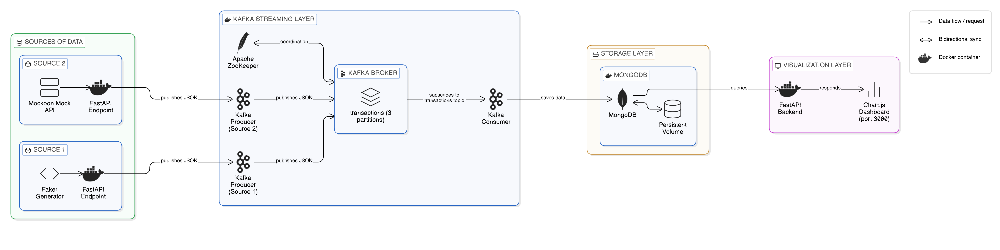

# Real-Time Transaction Streaming Pipeline

A complete end-to-end data streaming architecture using **Kafka**, **ZooKeeper**, **MongoDB**, **FastAPI**, **Faker**, and **Chart.js** — all orchestrated with **Docker Compose**.

---

## Architecture Overview

```
┌─────────────────────────────────┐        ┌──────────────────────────────────────────┐
│           SOURCE 2              │        │              KAFKA CLUSTER               │
│  ┌─────────────────────────┐    │        │                                          │
│  │  Mockoon-style Mock API │    │        │   ┌────────────┐    ┌────────────────┐   │
│  │  (built-in endpoint)    │    │        │   │ ZooKeeper  │    │  Kafka Broker  │   │
│  └────────────┬────────────┘    │        │   │ (coord.)   │◄───│  topic:        │   │
│               │ JSON            │        │   └────────────┘    │  transactions  │   │
│  ┌────────────▼────────────┐    │        │                     └───────┬────────┘   │
│  │   FastAPI Endpoint      │────┼──────► │  Kafka Producer (src2) ────►│            │
│  │   /produce              │    │        │  Kafka Producer (src1) ────►│            │
│  └─────────────────────────┘    │        └──────────────────────────────┼───────────┘
└─────────────────────────────────┘                                       │
                                                                          │ Subscribe
┌─────────────────────────────────┐                                       │
│           SOURCE 1              │        ┌─────────────────────────────▼──────────┐
│  ┌─────────────────────────┐    │        │          KAFKA CONSUMER                │
│  │   Faker Generator       │    │        │  Reads from 'transactions' topic        │
│  │   (realistic fake data) │    │        │  Writes to MongoDB (upsert)             │
│  └────────────┬────────────┘    │        └──────────────────────────┬─────────────┘
│               │ JSON            │                                    │
│  ┌────────────▼────────────┐    │        ┌───────────────────────────▼─────────────┐
│  │   FastAPI Endpoint      │────┼──────► │              MONGODB                    │
│  │   /produce              │    │        │   Database : transactions_db             │
│  └─────────────────────────┘    │        │   Collection: transactions              │
└─────────────────────────────────┘        │   Volume   : mongo-data (persistent)   │
                                           └───────────────────────────┬────────────┘
                                                                       │
                                           ┌───────────────────────────▼────────────┐
                                           │         DASHBOARD                       │
                                           │   FastAPI REST API  +  Chart.js UI      │
                                           │   http://localhost:3030                 │
                                           │   Auto-refreshes every 5 seconds        │
                                           └─────────────────────────────────────────┘
```
---

---

## Services

| Service         | Port  | Description                                              |
|----------------|-------|----------------------------------------------------------|
| `zookeeper`    | 2181  | Kafka cluster coordinator                                |
| `kafka`        | 9092  | Message broker — `transactions` topic                    |
| `kafka-init`   | —     | One-shot container that creates the Kafka topic          |
| `mongodb`      | 27017 | Persistent document store                                |
| `source2`      | 8001  | Mockoon-style mock API + Kafka producer (every 2s)       |
| `source1`      | 8002  | Faker generator + Kafka producer (every 3s)              |
| `kafka-consumer` | —  | Reads from Kafka → writes to MongoDB                     |
| `dashboard`    | 3030  | FastAPI backend + Chart.js real-time dashboard           |
| `AKHQ`    | 8080 | Kafka GUI           |
---

## Quick Start

```bash
# 1. Clone / enter the project directory
cd streaming-pipeline

# 2. Build and start all services
docker compose up --build

# 3. Open the dashboard
open http://localhost:3030
```

Give it ~30 seconds for Kafka to become healthy before producers connect.

---

## API Endpoints

### Source 2 (http://localhost:8001)
| Endpoint    | Method | Description                          |
|-------------|--------|--------------------------------------|
| `/mock-api` | GET    | Returns a single mock transaction    |
| `/produce`  | POST   | Manually trigger a Kafka publish     |
| `/health`   | GET    | Health check                         |

### Source 1 (http://localhost:8002)
| Endpoint    | Method | Description                          |
|-------------|--------|--------------------------------------|
| `/generate` | GET    | Returns a single Faker transaction   |
| `/produce`  | POST   | Manually trigger a Kafka publish     |
| `/health`   | GET    | Health check                         |

### Dashboard (http://localhost:3030)
| Endpoint           | Method | Description                        |
|--------------------|--------|------------------------------------|
| `/`                | GET    | Chart.js dashboard UI              |
| `/api/stats`       | GET    | KPI summary                        |
| `/api/by-category` | GET    | Transactions grouped by category   |
| `/api/by-status`   | GET    | Status breakdown                   |
| `/api/timeseries`  | GET    | Per-minute time series             |
| `/api/recent`      | GET    | Latest N transactions              |

---

## Stopping & Cleanup

```bash
# Stop all containers
docker compose down

# Stop and delete volumes (wipes MongoDB data)
docker compose down -v
```

---

## Project Structure

```
streaming-pipeline/
├── docker-compose.yml
├── mongo-init/
│   └── init.js              # MongoDB collection + index setup
├── source1/                 # Faker producer
│   ├── Dockerfile
│   ├── requirements.txt
│   └── main.py
├── source2/                 # Mockoon-style producer
│   ├── Dockerfile
│   ├── requirements.txt
│   └── main.py
├── kafka-consumer/          # Kafka → MongoDB writer
│   ├── Dockerfile
│   ├── requirements.txt
│   └── main.py
└── dashboard/               # FastAPI + Chart.js UI
    ├── Dockerfile
    ├── requirements.txt
    └── main.py
```
